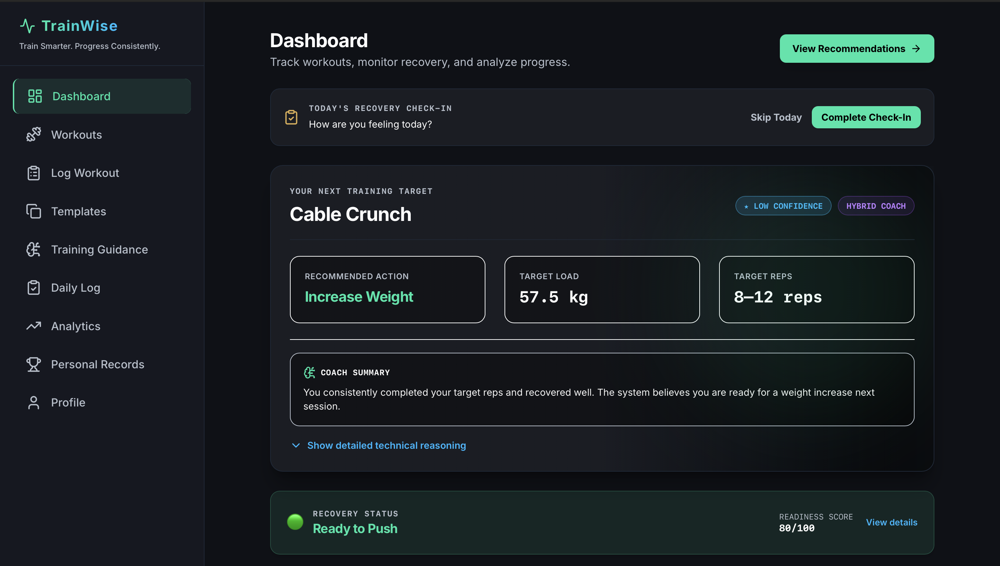
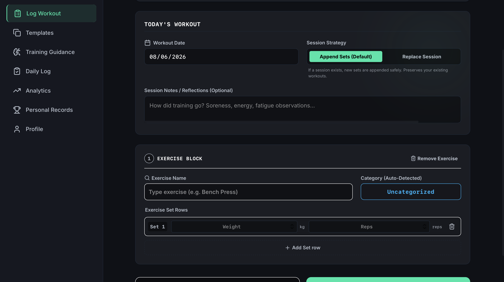
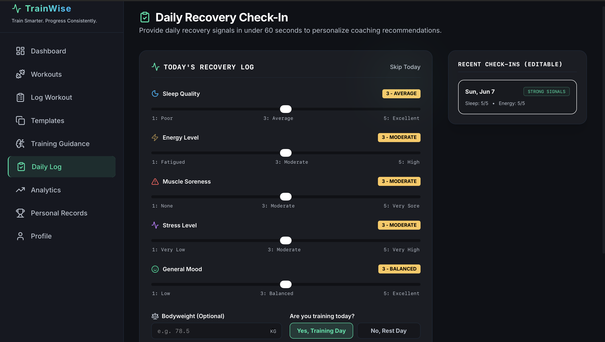
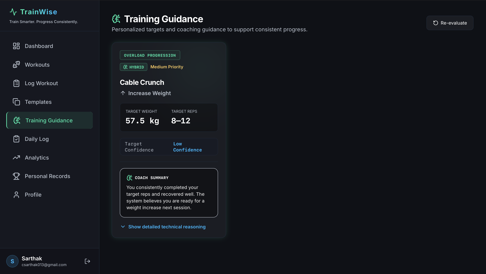
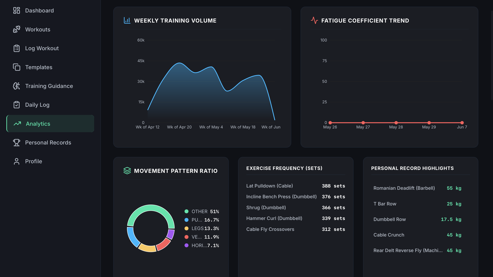
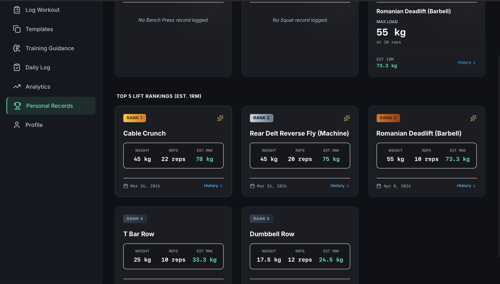

# TrainWise

### Train Smarter. Progress Consistently.



TrainWise is a full-stack fitness intelligence platform that combines workout tracking, recovery monitoring, performance analytics, and coaching intelligence to help athletes make informed training decisions.

Unlike traditional workout trackers that only record workouts, TrainWise analyzes training history, recovery signals, consistency patterns, personal records, and workout performance to provide actionable coaching insights and personalized training guidance.

---

## Project Highlights

✅ Full-stack MERN architecture

✅ JWT authentication and secure user management

✅ Daily workout logging and session builder

✅ Recovery monitoring and wellness tracking

✅ Personalized coaching intelligence engine

✅ Progressive overload recommendations

✅ Workout templates and saved routines

✅ Personal records and estimated 1RM tracking

✅ Performance analytics dashboard

✅ Machine-learning powered recommendation engine

---

## Why TrainWise?

Most fitness applications stop at recording workouts.

TrainWise goes beyond tracking by combining:

* Workout Logging
* Recovery Monitoring
* Coaching Intelligence
* Performance Analytics
* Personal Records
* Progressive Overload Guidance

into a single athlete-focused platform.

The objective is simple:

**Train Smarter. Progress Consistently.**

---

## Features

### Training Management

* Manual workout logging with dynamic session builder
* Workout templates (Push, Pull, Legs, Upper/Lower, and custom routines)
* CSV workout history import
* Exercise history and session exploration
* Draft autosave and session recovery
* Session notes and workout reflections

### Coaching Intelligence

* Training Readiness Score
* Recovery Recommendations
* Consistency Tracking
* Plateau Detection
* Progress Status Analysis
* Next Training Target Recommendations
* Progressive Overload Guidance

### Recovery Monitoring

* Daily Recovery Check-Ins
* Sleep, Energy, Stress, Mood, and Soreness tracking
* Recovery Context Scoring
* Recovery Trend Analysis
* Recovery-adjusted readiness calculations

### Analytics & Insights

* Weekly Volume Trends
* Long-Term Progress Analytics
* Movement Pattern Balance Analysis
* Training Consistency Metrics
* Historical Performance Tracking
* Fatigue Coefficient Tracking

### Personal Records

* Personal Record Hall of Fame
* Estimated 1RM Calculations
* Compound Lift Rankings
* Achievement Tracking
* Exercise-Specific Progress Pages

### Workout Templates

* Built-in Push/Pull/Legs templates
* Upper Body and Lower Body routines
* Custom workout templates
* Save workouts as reusable routines
* Quick-start training workflows
* Template usage tracking

---

## System Architecture

```text
React + Vite Frontend
          │
          ▼
      Express API
          │
 ┌────────┼────────┐
 ▼        ▼        ▼
MongoDB  Coaching  Analytics
         Engine     Engine
            │
            ▼
     Recovery Context
            │
            ▼
     Recommendations
```

---

## Technology Stack

### Frontend

* React
* Vite
* Tailwind CSS
* Lucide React
* Axios
* Recharts

### Backend

* Node.js
* Express.js

### Database

* MongoDB
* Mongoose

### Machine Learning

* FastAPI
* Python
* Scikit-Learn
* Random Forest Models

### Authentication & Security

* JWT Authentication
* Password Hashing
* Protected API Routes

---

## Core Modules

| Module            | Purpose                                  |
| ----------------- | ---------------------------------------- |
| Dashboard         | Coaching-first athlete overview          |
| Workout Logger    | Manual workout entry and tracking        |
| Daily Log         | Recovery and wellness tracking           |
| Templates         | Saved routines and quick-start workouts  |
| Analytics         | Performance and volume analysis          |
| Personal Records  | PR tracking and rankings                 |
| Training Guidance | AI-assisted coaching recommendations     |
| Workouts          | Training ingestion and exercise analysis |

---

## Screenshots

### Dashboard


### Workout Logger



### Daily Recovery Check-In



### Training Guidance



### Templates


### Analytics



### Personal Records



---

## Repository Structure

```text
TrainWise/
│
├── frontend/
│   ├── src/
│   ├── components/
│   ├── pages/
│   ├── layouts/
│   └── services/
│
├── backend/
│   ├── controllers/
│   ├── models/
│   ├── routes/
│   ├── services/
│   ├── middleware/
│   └── ml-service/
│
├── screenshots/
│
├── README.md
└── .gitignore
```

---

## Installation

### Clone Repository

```bash
git clone https://github.com/Sarthak0205/TrainWise.git
cd TrainWise
```

### Backend Setup

```bash
cd backend

npm install

npm run dev
```

### Frontend Setup

```bash
cd frontend

npm install

npm run dev
```

### Machine Learning Service

```bash
cd backend/ml-service

pip install -r requirements.txt

uvicorn app:app --reload
```

---

## Environment Variables

Create a `.env` file inside the backend directory.

```env
PORT=5000

MONGO_URI=your_mongodb_connection_string

JWT_SECRET=your_secret_key

ML_SERVICE_URL=http://localhost:8000
```

---

## Future Roadmap

### Phase 8 – Adaptive Programming

* Weekly training plans
* Auto-regulated progression
* Deload recommendations
* Exercise substitutions
* Adaptive volume management

### Phase 9 – Intelligent Coaching

* Goal-specific coaching modes
* Fatigue-aware progression
* Readiness-based volume adjustment
* Adaptive workout programming
* Dynamic training periodization

### Platform Expansion

* Cloud deployment
* Mobile application
* Coach-athlete dashboards
* Social training groups
* Wearable integrations
* Push notifications

---

## Project Status

**Version:** v1.2.0

### Current Release Includes

* Coaching Intelligence
* Daily Recovery Context
* Workout Logger
* Workout Templates
* Performance Analytics
* Personal Records
* Recovery Tracking
* Machine Learning Recommendation Engine

TrainWise has evolved from a workout analytics tool into a complete fitness intelligence platform designed to help athletes train smarter, recover better, and progress consistently.

---

## Author

**Sarthak Chaudhary**

Computer Engineering Student

GitHub: https://github.com/Sarthak0205

Project: **TrainWise – Fitness Intelligence Platform**

### Tagline

**Train Smarter. Progress Consistently.**
