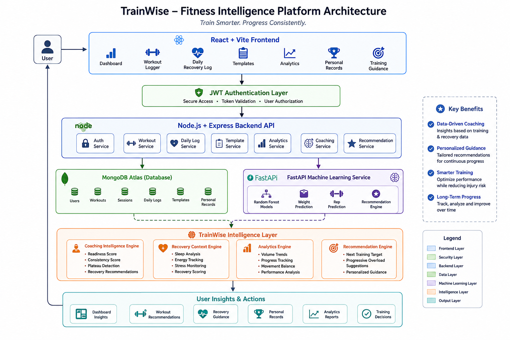

# TrainWise

# Train Smarter. Progress Consistently.

TrainWise is a full-stack fitness intelligence platform that combines workout tracking, recovery monitoring, performance analytics, and coaching intelligence to help athletes make smarter training decisions.

Unlike traditional workout trackers that simply record workouts, TrainWise analyzes training history, recovery signals, consistency patterns, progression trends, and personal records to provide actionable coaching recommendations and long-term performance insights.

---

## Overview

TrainWise acts as a daily fitness companion by combining:

- Workout Tracking
- Recovery Monitoring
- Training Analytics
- Personal Records Tracking
- Coaching Intelligence
- Workout Templates
- Machine Learning Assisted Recommendations

The platform continuously evaluates both training performance and recovery readiness to help users train effectively while reducing the risk of stagnation and overtraining.

---

# Features

## Workout Management

- Manual Workout Logger
- Dynamic Session Builder
- Session Notes & Reflections
- CSV Workout History Import
- Exercise History Tracking
- Session Timeline Exploration
- Draft Autosave & Recovery
- Append / Replace Session Modes

---

## Workout Templates

- Built-in Push Day Template
- Built-in Pull Day Template
- Built-in Leg Day Template
- Built-in Upper Body Template
- Built-in Lower Body Template
- Custom Workout Templates
- Save Existing Workouts as Templates
- Quick Start Training Workflows
- Template Usage Tracking

---

## Recovery Monitoring

### Daily Recovery Check-In

Track:

- Sleep Quality
- Energy Levels
- Stress Levels
- Mood
- Muscle Soreness
- Bodyweight
- Training Day Status

### Recovery Intelligence

- Recovery Context Scoring
- Recovery Trend Analysis
- Recovery Recommendations
- Recovery-Adjusted Coaching

---

## Coaching Intelligence

TrainWise combines historical training performance and recovery signals to generate:

### Readiness Analysis

- Training Readiness Score
- Recovery Status
- Readiness Trend Analysis
- Fatigue Monitoring

### Training Guidance

- Progressive Overload Suggestions
- Next Session Targets
- Weight Progression Recommendations
- Rep Range Recommendations
- Exercise-Level Coaching

### Performance Monitoring

- Consistency Score
- Training Streak Analysis
- Plateau Detection
- Progress Status Analysis

---

## Analytics & Insights

### Performance Analytics

- Weekly Training Volume Trends
- Historical Progress Tracking
- Long-Term Training Trends
- Exercise Frequency Analysis

### Training Balance

- Movement Pattern Analysis
- Push/Pull/Legs Distribution
- Volume Distribution Insights

### Recovery Analytics

- Recovery Trends
- Sleep Trends
- Energy Trends
- Stress Trends
- Soreness Trends

---

## Personal Records

### PR Hall of Fame

- Top Lift Rankings
- Estimated 1RM Tracking
- Exercise Record Pages
- Historical Record Progression

### Achievements

- Strength Milestones
- Progress Highlights
- Performance Records

---

# System Architecture

```text
                                ┌──────────────┐
                                │    User      │
                                └──────┬───────┘
                                       │
                                       ▼
                     ┌──────────────────────────────┐
                     │ React + Vite Frontend       │
                     │                              │
                     │ • Dashboard                 │
                     │ • Workout Logger            │
                     │ • Templates                │
                     │ • Daily Recovery Log       │
                     │ • Analytics                │
                     │ • Personal Records         │
                     │ • Training Guidance        │
                     └──────────────┬─────────────┘
                                    │
                                    ▼
                     ┌──────────────────────────────┐
                     │ JWT Authentication Layer    │
                     └──────────────┬─────────────┘
                                    │
                                    ▼
                     ┌──────────────────────────────┐
                     │ Node.js + Express Backend    │
                     │                              │
                     │ • Auth Service              │
                     │ • Workout Service           │
                     │ • Daily Log Service         │
                     │ • Template Service          │
                     │ • Analytics Service         │
                     │ • Coaching Service          │
                     │ • Recommendation Service    │
                     └───────┬─────────┬──────────┘
                             │         │
               ┌─────────────┘         └─────────────┐
               ▼                                     ▼

┌───────────────────────────┐      ┌───────────────────────────┐
│ MongoDB Atlas             │      │ FastAPI ML Service        │
│                           │      │                           │
│ • Users                   │      │ • Random Forest Models   │
│ • Workouts                │      │ • Weight Prediction      │
│ • Sessions                │      │ • Rep Prediction         │
│ • Daily Logs              │      │ • Recommendation Engine  │
│ • Templates               │      │                           │
│ • Personal Records        │      │                           │
└──────────────┬────────────┘      └──────────────┬────────────┘
               │                                  │
               └──────────────┬───────────────────┘
                              ▼

         ┌─────────────────────────────────────────────┐
         │      TrainWise Intelligence Layer           │
         └─────────────────────────────────────────────┘

                 ┌─────────────┐
                 │ Coaching    │
                 │ Engine      │
                 │             │
                 │ Readiness   │
                 │ Consistency │
                 │ Plateau     │
                 └──────┬──────┘

                 ┌──────▼──────┐
                 │ Recovery    │
                 │ Engine      │
                 │             │
                 │ Sleep       │
                 │ Energy      │
                 │ Stress      │
                 │ Recovery    │
                 └──────┬──────┘

                 ┌──────▼──────┐
                 │ Analytics   │
                 │ Engine      │
                 │             │
                 │ Volume      │
                 │ Progress    │
                 │ Balance     │
                 └──────┬──────┘

                 ┌──────▼──────┐
                 │ Recommendation
                 │ Engine
                 │
                 │ Next Targets
                 │ Overload
                 │ Guidance
                 └──────┬──────┘
                        │
                        ▼

        ┌────────────────────────────────────┐
        │ User Insights & Actions            │
        │                                    │
        │ • Dashboard Insights               │
        │ • Workout Recommendations          │
        │ • Recovery Guidance                │
        │ • Personal Records                 │
        │ • Analytics Reports                │
        │ • Training Decisions               │
        └────────────────────────────────────┘
```

---

# Technology Stack

## Frontend

- React
- Vite
- JavaScript (ES6+)
- Tailwind CSS
- Lucide React
- Recharts

---

## Backend

- Node.js
- Express.js
- REST APIs

---

## Database

- MongoDB Atlas
- Mongoose ODM

---

## Machine Learning

- Python
- FastAPI
- Scikit-Learn
- Random Forest Models

### ML Capabilities

- Weight Prediction
- Repetition Prediction
- Recommendation Assistance

---

## Authentication & Security

- JWT Authentication
- Protected Routes
- Password Hashing
- Secure API Middleware
- User-Level Data Isolation

---

# Core Modules

| Module | Purpose |
|----------|----------|
| Dashboard | Athlete overview and coaching insights |
| Workout Logger | Manual workout tracking |
| Templates | Reusable workout routines |
| Daily Log | Recovery and wellness tracking |
| Training Guidance | Coaching recommendations |
| Analytics | Performance analysis and trends |
| Personal Records | PR tracking and rankings |
| Profile | Athlete profile management |

---

# Screenshots

## Dashboard


---

## Training Guidance


---

## Daily Recovery Check-In


---

## Workout Logger


---

## Templates


---

## Analytics


---

## Personal Records


---

## Architecture Diagram



---

# Installation

## Clone Repository

```bash
git clone https://github.com/Sarthak0205/TrainWise.git
cd TrainWise
```

---

## Backend Setup

```bash
cd backend

npm install

npm run dev
```

Runs on:

```text
http://localhost:5000
```

---

## Frontend Setup

```bash
cd frontend

npm install

npm run dev
```

Runs on:

```text
http://localhost:5173
```

---

## Machine Learning Service

```bash
cd backend/ml-service

pip install -r requirements.txt

uvicorn app:app --reload
```

Runs on:

```text
http://localhost:8000
```

---

# Current Release

## Version

**v1.2.0**

### Included Features

✅ Coaching Intelligence

✅ Daily Recovery Context

✅ Workout Logger

✅ Workout Templates

✅ Recovery Tracking

✅ Performance Analytics

✅ Personal Records

✅ Machine Learning Recommendations

✅ Progressive Overload Guidance

---

# Future Roadmap

## Phase 8 – Adaptive Programming

- Weekly Training Plans
- Auto-Regulated Progression
- Deload Recommendations
- Intelligent Exercise Substitutions
- Adaptive Volume Management

---

## Future Platform Enhancements

- Cloud Deployment
- Mobile Application
- Coach Dashboard
- Social Features
- Wearable Integration
- Advanced AI Coaching

---

# Author

**Sarthak Chaudhari**

TrainWise was built to help athletes train smarter, recover better, and progress consistently through data-driven fitness intelligence.

---

## Tagline

### Train Smarter. Progress Consistently.